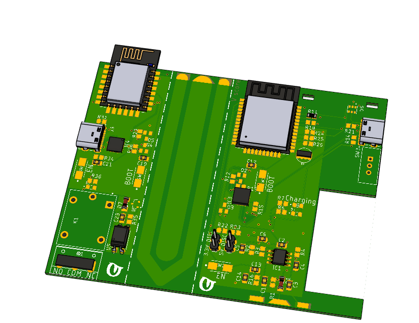

# IoT Environmental Monitoring Device

## Overview

This project is an IoT environmental monitoring device developed using ESP32 microcontroller. It incorporates sensors such as BMP280, BME280, a capacitive moisture sensor, and a temperature sensor. The device is designed to collect data from its deployment area, which could be a field or any outdoor environment. It operates on a rechargeable Li-ion battery and communicates data to an OpenRemote host via the internet. Additionally, there are variants of the device, one powered by a battery and another connected to the grid, which functions as a relay controlled by an ESP8266.

## Features

- Monitoring environmental parameters including temperature, pressure, humidity, and soil moisture.
- Publishes data to an OpenRemote host for remote monitoring and analysis.
- Two variants available: battery-powered and grid-tied with relay functionality.

## Installation

### Hardware Requirements
- ESP32 microcontroller
- BMP280 sensor
- BME280 sensor
- Capacitive moisture sensor
- Temperature sensor
- Li-ion battery (for battery-powered variant)
- ESP8266 (for grid-tied variant with relay)

### Software Requirements
- ESP-IDF development framework
- MQTT library
- lwIP library
- FreeRTOS
- OpenRemote host account

### Steps
1. Clone this repository to your local machine.
2. Set up the ESP-IDF environment according to the official documentation.
3. Configure MQTT parameters in `secret.h`.
4. Flash the firmware to your ESP32 device.
5. Deploy the device in the desired location.

## Usage

1. Power on the device.
2. Ensure it is connected to the internet.
3. Data will be automatically collected from sensors and published to the configured OpenRemote host.
4. Access the OpenRemote dashboard to view real-time data and analytics.

# V1_wifi-mqtt
Change MQTT_username with the one you created on the openremote platform 

Change MQTT_password with the one on the openremote platform clients tab

Change Client_ID so that differs from 2 devices connected to same asset / server

Change MQTT_Server ip to the one of the server you are connecting to mqtt://XXX.XXX.X.XXX:1883 / 8883 

HAVE ALL THE ASSET ATTRIBUTES THE SAME AS THE ONES YOU ARE SUBSCRIBING / PUBLISHING TO  THE SAME NAME, THE SAME EVERYTING 

## Acknowledgments

- Special thanks to OpenRemote and Espressif for their support and resources.

